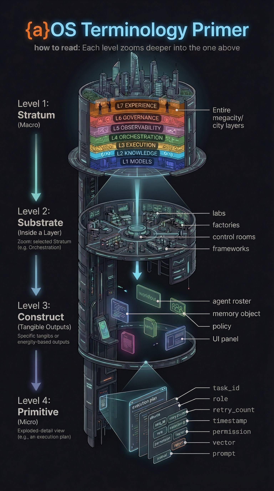

<<<<<<< Updated upstream
# {a}OS Explorer

### The OSI Model for AI

> There are 500+ AI products. Most people can't name which layer their problem lives in.  
> **{a}OS fixes that.**

<p align="center">
  <a href="https://vitaminr.github.io/aos-explorer/">
    
  </a>
</p>

<p align="center">
  <a href="LICENSE"></a>
  
  
  
  
</p>

<p align="center">
  <strong><a href="https://vitaminr.github.io/aos-explorer/">Launch Explorer</a></strong> · <a href="#the-7-stratum-model">The Model</a> · <a href="#features">Features</a> · <a href="#confidence-decay">Trust Scores</a> · <a href="#contributing">Contribute</a>
</p>

---

## The Problem

Every AI platform demo is impressive. Then you try to deploy it for real.

No approval gate. No cost kill switch. No audit trail your compliance team can hand to an assessor. The model works — but nobody can tell you *which part of the system failed* when it doesn't.

**The reason:** AI tooling doesn't have a shared vocabulary. Networking has the OSI model. Software has the stack. AI has... marketing pages.

## The Fix

**{a}OS** (Agentic Operating System) is a 7-layer reference model that gives every AI product, framework, and agent a precise address in the stack.

Each level zooms deeper into the one above:

| Level | Concept | Think of it as... |
|:-----:|---------|------------------|
| **Stratum** | A horizontal layer (L1–L7) | An OSI layer |
| **Substrate** | A capability group inside a stratum | A protocol family |
| **Construct** | A specific artifact or pattern | A protocol |
| **Primitive** | An atomic building block | A packet field |

## The 7-Stratum Model

```
┌─────────────────────────────────────────────────┐
│  L7  Experience & Intent                        │  Chat UIs, IDE extensions, voice, intent routing
├─────────────────────────────────────────────────┤
│  L6  Governance & Trust                         │  Policy, compliance, audit trails, guardrails
├─────────────────────────────────────────────────┤
│  L5  Observability & Evaluation                 │  Tracing, evals, cost metering, drift detection
├─────────────────────────────────────────────────┤
│  L4  Orchestration & Decisioning                │  Agent loops, DAGs, routers, planning, HITL
├─────────────────────────────────────────────────┤
│  L3  Execution & Interfaces                     │  Tool calling, code interpreters, MCPs, APIs
├─────────────────────────────────────────────────┤
│  L2  Knowledge & Memory                         │  RAG, vector stores, context, long-term memory
├─────────────────────────────────────────────────┤
│  L1  Models & Infrastructure                    │  LLMs, embeddings, fine-tuning, serving, compute
└─────────────────────────────────────────────────┘
```

**Key insight:** Most AI platforms are strong at L1–L3 and structurally weak at L5–L7. What marketing calls "one gap" is actually three separate architectural problems with three different owners.

## Features

| Feature | What it does |
|---------|-------------|
| **Product Lens** | Click any product → see exactly which strata it covers |
| **Compare Mode** | Side-by-side up to 4 products with automatic gap detection |
| **Golden Path** | Curated best-in-class stacks for agentic coding, RAG, and more |
| **Cascading Filters** | Drill by stratum → substrate → construct → axis → deployment |
| **Confidence Scores** | Every mapping is scored (0–1.0) and dated — not just claimed |
| **Freshness Decay** | Scores visually fade after 90 days without re-verification |
| **Gap Analysis** | Compare matrix shows exactly which strata have no coverage |
| **Deep Linking** | Share any filtered view via URL hash |
| **Keyboard Nav** | `j`/`k` to browse, `/` to search, `?` for all shortcuts |
| **Zero Dependencies** | Single HTML file. No build step. No framework. Just open it. |

## Confidence Decay

Every product mapping includes:

- **`confidence`** — a 0.0–1.0 score based on documentation review and hands-on testing
- **`lastVerified`** — the date the mapping was last checked against current product state

Scores are **not permanent.** After 90 days without re-verification:

```
Fresh (0–60 days)   ████████████████████  Green — high trust
Aging (60–90 days)  ████████████░░░░░░░░  Yellow — review soon
Stale (90+ days)    ████░░░░░░░░░░░░░░░░  Red + ⏳ — needs reassessment
```

This exists because the AI ecosystem moves fast. A mapping that was accurate in April may be wrong by July. **If a score looks stale, open an issue** — that's how the taxonomy stays alive.

## Quick Start

No build. No install. No dependencies.

```bash
git clone https://github.com/vitaminR/aos-explorer.git
cd aos-explorer
start index.html   # Windows
open index.html    # macOS
xdg-open index.html # Linux
```

## Who Is This For?

| You are... | You'll use it to... |
|-----------|-------------------|
| **AI Architect** | Map your stack. Find gaps. Choose tools with coordinates, not vibes. |
| **Engineering Leader** | Evaluate vendors against a framework that isn't a vendor's framework. |
| **DevRel / Product** | See exactly where your product sits — and what it's competing with. |
| **Student / Career Changer** | Learn the full AI stack, not just the model layer everyone talks about. |
| **IT Professional** | Translate AI hype into architecture decisions you can defend. |

## Contributing

The taxonomy is only as good as the community behind it.

| Action | How |
|--------|-----|
| **Add a product** | [Open an issue](https://github.com/vitaminR/aos-explorer/issues/new?template=product-suggestion.md) |
| **Correct a mapping** | [Open an issue](https://github.com/vitaminR/aos-explorer/issues/new?template=mapping-correction.md) |
| **Propose taxonomy changes** | Start a [Discussion](https://github.com/vitaminR/aos-explorer/discussions) |
| **Re-verify a stale score** | Check the product's current docs and comment on the mapping |

See [CONTRIBUTING.md](CONTRIBUTING.md) for details.

## Roadmap

- [x] 7-stratum model with 40+ products mapped
- [x] Side-by-side comparison with gap analysis
- [x] Golden Path curated builds
- [x] Confidence scoring with freshness decay
- [ ] GitHub Pages live deployment
- [ ] Community-submitted product mappings via PR
- [ ] Automated product changelog monitoring (agent-assisted)
- [ ] Vendor-verified badges program
- [ ] Embeddable stratum badge for product READMEs
- [ ] API for programmatic taxonomy access

## The Bigger Picture

{a}OS Explorer is the open-source taxonomy. The consulting and advisory practice behind it is [initiate.work](https://initiate.work) — stack audits, architecture reviews, and vendor selection for teams building production AI.

The Explorer is the shared vocabulary. What you build with it is up to you.

## License

[MIT](LICENSE) — use it, fork it, map your stack.

---

<p align="center">
  <sub>Built by <a href="https://github.com/vitaminR">vitaminR</a> · The OSI model gave networking a common language. It's time AI had one too.</sub>
</p>
=======
# 90 — {a}OS Explorer

> Interactive taxonomy and comparison engine for the {a}OS Agentic Reference Stack.

## What This Is

A cinematic Next.js web app that lets users browse, expand, filter, and compare AI systems from **Stratum to Primitive** across products, frameworks, agents, workflows, and skills.

## Source of Truth

| Artifact | Location |
|----------|----------|
| **PRD + SPEC** | `C:/Users/nymil/Codepro/6.aOS/05.Architecture/PRD_SPEC_aOS_Explorer.md` |
| **{a}OS Reference Model v1.0** | `C:/Users/nymil/Codepro/6.aOS/01.Reference-Model/agentic-reference-stack-v1.md` |
| **Vendor Mappings** | `C:/Users/nymil/Codepro/6.aOS/02.Vendor-Mappings/` |

## Tech Stack

```
Next.js 15 + TypeScript + Tailwind CSS v4
  + Aceternity UI        → cinematic components (aurora, 3D cards, tracing beams, floating dock)
  + Magic UI             → particle/shimmer/orbit effects
  + assistant-ui         → agentic AI primitives (threads, tool-call UIs, MCP)
  + shadcn/ui + Radix    → accessible base primitives
  + Framer Motion        → layout morphs, spring physics
  + GSAP ScrollTrigger   → scroll-based cinematic choreography
  + Zustand              → lightweight state
```

## Status

**Interactive prototype live.**

- `prototype.html` delivers the cinematic explorer shell with drilldown, compare basket, search, and basic filter interactions.
- `docs.html` provides an in-app client documentation hub.
- `/docs/` contains markdown docs for onboarding and classification reference.
>>>>>>> Stashed changes
